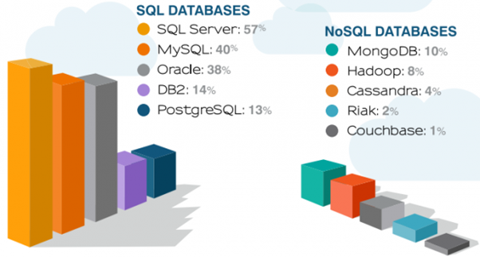

# Новые возможности NoSQL

Основные фреймоворки для работы с большими данными стали доминирующим трендом в 2015 году. Однако нельзя сказать, что аналитики и разработчики ограничились только этим вопросом. Новые технологии и идеи появились также и в области неструктурированных баз данных.

Одной из основных черт больших данных сегодня является изобилие новых движков и инструментов хранения данных. В 2015 году перемены затронули и сферу, которая связана с NoSQL и кластерами Hadoop. Появилось большое разнообразие новых компонентов обработки данных, выходили критичные и не очень обновления. Обилие новаций в этой области становится вызовом для профессионалов в сфере управления данными. От них требуется умение отлично ориентироваться в лабиринте новых систем.

## Новые разработки в области неструктурированных баз данных

Долгое время в высоких технологиях господствовали традиционные структурированные базы данных. Появление неструктурированных баз данных в какой-то степени стало рассматриваться в качестве альтернативы прежним подходам. Однако, как и прежде, возник вопрос о программном обеспечении для доступа к NoSQL.

### Основные характеристики SQL и NoSQL в сравнении

Источник: <www.edureka.co>

Ранее из-за объективной ситуации на рынке пользователям предлагались различные варианты реляционных баз данных, количество вендоров которых ограничивалось очень небольшим числом. В случае с NoSQL ситуация меняется с огромной скоростью прямо на глазах. Число предложений различных технологий, имеющих отношение к NoSQL, постоянно росло в течение всего 2015 года, и, по мнению специалистов, этот рост будет продолжаться и в 2016 году.

### Доля производителей различных типов баз данных на рынке (данные 2014 г.)

Источник: Tesora

Расширение предложения идет не только за счет разработки новых технологий и платформ, но и за счет увеличения количества вендоров, которые предлагают свои решения потребителям. Один из наиболее известных брендов последнего времени MongoDB в 2015 году предложила рынку новый движок для своей одноименной неструктурированной базы данных. Компания также заявила, что движок будет поддерживать большое разнообразие плагинов, придающих гибкий стиль, который знаком многим разработчикам, имеющим опыт работы с MySQL.

Новый движок MongoDB под названием Wired Tiger, помимо всего прочего, может решать сложные вопросы, которые ранее не могла решить оригинальная платформа MongoDB.

Появление неструктурированных баз данных стало естественным ответом на вызовы современности. Безусловно, структурированные базы данных удобны для работы во многих отношениях. Их можно проектировать, для них разработан вполне простой язык программирования. Они вообще просты и понятны. Однако человек сталкивается с потоком таких данных, которые изначально не имеют унифицированной формы. Раньше это усложняло процесс хранения и обработки.
Кроме того, для работы с неструктурированными данными, что вполне очевидно, не подходит язык SQL. Только в некоторых случаях имеется частичная поддержка стандартного структурированного языка программирования. Многие пользователи NoSQL уверены, что SQL-подобные возможности полезны. Их можно использовать как важную часть работы со всеми видами данных.

В ответ на запросы пользователей появились проекты различных вендоров в этом направлении. Так в 2015 году Couchbase представила свой вариант языка запросов N1QL, или Nickel. Данный продукт подходит для создания SQL-подобной среды, необходимой для работы с системой управления неструктурированными базами данных.
Адаптации SQL для платформы Hadoop

Сегодня можно говорить о двух тенденциях в управлении базами данных: о так называемой SQL-изации технологий NoSQL и SQL-адаптации Hadoop. Однако если в первом случае все только начинается, то во втором можно говорить о своеобразном взрыве технологий.

Сегодня уже известны разработанные в последние годы движки SQL над Hadoop. Среди них такие, как Hive, Impala и Presto. Они были представлены рынку буквально один за другим в последние несколько лет. В 2015 году также выходили релизы и обновления в этой области.

### Экосистема Hadoop и ее элементы

Источник: <www.dezyre.com>

Подобные инструменты необходимы для того, чтобы можно было обеспечить легкий доступ к информации и ее использование в «озерах данных» Hadoop. В результате, неструктурированные данные будут переведены в более доступные для работы с ними формы (data refineries), а также уменьшатся «болота данных» (data swamps).
Но SQL на Hadoop не представляет какого-то сверхнового явления, поскольку известны случаи попыток адаптации, целью которых было выявить, какие инструменты лучше работают при различных интерактивных задачах. Существует много положительных отзывов о работе пользователей в такой среде. Однако критики считают вероятным то обстоятельство, что Hadoop перестанет занимать ведущие позиции на многих предприятиях, если нельзя будет с помощью новых технологий задействовать навыки множества сотрудников, разбирающихся в SQL.

Однако есть надежда на то, что вендоры и распространители платформ с открытым исходным кодом продолжат свои разработки и дополнят новыми технологиями ядро Hadoop. В качестве примера можно привести компанию Cloudera, которая в октябре 2015 года дополнила сборку Hadoop проектом Kudu для столбчатых баз данных. Данная разработка сделает более эффективным функционирование Impala, который является движком SQL для Hadoop. Он полезен для решения задач в области аналитики в реальном режиме времени, когда требуются блоки быстрых данных и быстрые обновления. В зависимости от предпочтений пользователей, Kudu может стать дополнением или альтернативой Hadoop Distributed File System. HDFS уже давно выполняет функции средства хранения данных в Hadoop.

## Где и как можно использовать приложения для неструктурированных данных?

### Управление профилями

Управление профилями пользователей в интернет- и мобильных приложениях необходимо при проведении онлайн-транзакций, выявления предпочтений пользователя, идентификации пользователя и многого другого. Реляционные базы данных уже с трудом справляются с масштабируемостью, гибкостью данных и повышенными требованиями к функциональности. Поэтому ведущие компании обращают свои взоры на NoSQL, позволяющие управлять сотнями миллионов профилей.

### Управление контентом

Управление разнообразным контентом на сайтах интернет-магазинов, в интернет-публикациях, цифровых архивах и т.п. является важной задачей любой компании. NoSQL позволяют обеспечить пользователям с помощью специальных приложений быстрый и легкий доступ к любым типам контента: структурированным и неструктурированным данным (тексты, фото, видео и многое другое).

### Данные о потребителях

Создание и поддержка унифицированного образа потребителя – важная задача для компаний. Потребители имеют дело с большим количеством товаров и услуг, брендов и компаний. Для того чтобы эффективно использовать предпочтения потребителей, необходимо отслеживать весь огромный массив информации о пользователях. Это также можно сделать наилучшим образом только с NoSQL.

### Обнаружение угроз

Эффективное использование технологий больших данных, в частности, возможностей NoSQL, особенно ярко проявляется в сфере безопасности. В частности, новые приложения позволяют сделать более эффективными и безопасными финансовые услуги и транзакции, снизить риски и существенно сократить возможные потери в результате кризисных явлений. Причем, изменения в политике финансовых организаций идут на пользу и потребителям. Поскольку структурированные базы данных в этой области уже мало помогают, многие банки и финансовые организации обращаются к технологиям NoSQL.

### Интернет вещей

Развитие мобильных технологий привело к тому, что сегодня в мире насчитывается около 20 миллиардов устройств, которые генерируют огромное количество информации. И это не считая того, что небольшими компьютерами также оснащены многие современные электронные приборы, автомобили и т.п. Происходит обмен данными в самой различной форме, передается информация о местонахождении конкретных людей или устройств. Со всем этим традиционные системы управления базами данных уже не справляются, поэтому ведущие компании и здесь стали обращаться к NoSQL.

### Цифровые коммуникации

Прошло время, когда средств коммуникации насчитывалось всего лишь несколько видов. Современные люди имеют дело с самыми различными видами цифровых коммуникаций: мессенджерами в смартфонах и на компьютерах, чатами, специальными приложениями для корпоративной работы и т.д. Требуется обработка разнообразной и богатой информации в реальном режиме времени. И здесь опять помогают неструктурированные базы данных.

### Идентификация пользователей

Персональная аутентификация завоевывает все больше и больше сфер жизни общества. Это одновременно и возможность, и вызов. Особенно, данный способ идентификации становится вызовом для различных устройств и программных приложений. Практика показывает, что и в этой области лучше всего с проблемой справляются приложения NoSQL.

### Каталоги

Понятие каталога сегодня связывают не только с библиотеками и архивами. В том или ином виде каталоги используются в веб- и мобильных приложениях, платежных терминалах, киосках самообслуживания, финансовых базах, данных о сотрудниках, рейтингах и других сферах. Особенностью таких каталогов является генерируемый пользователями контент, который все чаще просто невозможно обрабатывать с помощью традиционных баз данных.

### Большие данные в реальном времени

В современных условиях для многих предприятий крайне важно располагать возможностями извлекать информацию и пользоваться ею в реальном режиме времени. Чем быстрее и объемнее предприятие получает информацию, тем лучше его позиции в конкурентной борьбе, ниже расходы и выше прибыль. Сегодня вендоры предлагают самые различные технологии больших данных в реальном времени, в частности, комплексы, включающие фреймворк Hadoop и NoSQL. Их совместное применение позволяет эффективно решить поставленные задачи.

### Мобильные приложения

Смартфоны, планшеты и другие мобильные устройства становятся доминирующими инструментами для работы в интернете, оплаты покупок, финансовых решений и многого другого. Мобильные приложения все чаще используются вместо браузеров для различных целей. Однако такая тенденция требует от баз данных масштабируемости, эффективности и доступности, с точки зрения компаний. Поэтому вендоры предлагают все больше специальных мобильных приложений для NoSQL.
