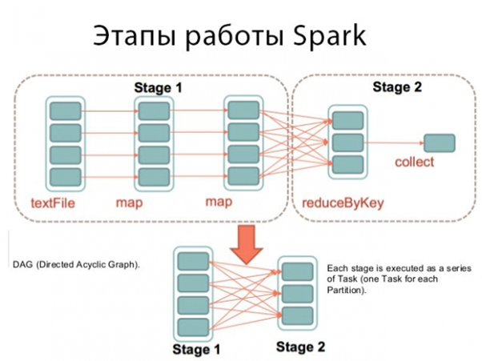

# Spark vs Hadoop vs Storm

Многие компании, чей бизнес в той или иной мере связан с большими данными, рано или поздно сталкиваются с проблемой выбора наиболее эффективного и подходящего для их работы движка. Многие предпочитают платформы с открытым исходным кодом. Но как понять, какая из них подойдет для ваших целей наилучшим образом?

Сегодня вендоры предлагают пользователям множество разработок для хранения и обработки больших данных, машинного обучения и бизнес-аналитики в реальном времени. Специалистам приходится тщательно отслеживать все новинки программного обеспечения, обновления уже установленных продуктов и разбираться в деталях работы различных новых платформ. Это далеко не так просто, как кажется на первый взгляд.

И в первую очередь, проблема порой заключается в том, что производители технологий для Big Data, как многие другие компании любого сектора экономики, склонны создавать ажиотаж вокруг своей продукции и рекламировать ее в качестве самой эффективной и надежной. Чтобы не быть голословными, приведем несколько примеров, касающихся таких известных сегодня фреймворков, как Apache Spark и Apache Storm.

«Лидерство Cloudera, благодаря Spark, было завоевано реальными инновациями, которые наши потребители ценят за скорость и сложность в крупномасштабном машинном обучении. Во всем – от улучшения результатов лечения до прогнозирования отключений сети – Spark становится «must have» элементом в стеке Hadoop», – говорит директор отдела контроля производства Alpine Data Labs Стивен Хиллион.

Платформа Spark действительно пользуется признанием среди многих пользователей. Но для производителей важно, чтобы ажиотаж вокруг программы не спадал.

«Spark – это то, что можно назвать швейцарским военным ножом в аналитическом инструментарии больших данных», - говорит ведущий разработчик Berkeley AmpLab Рейнольд Син.

Spark не является исключением из правил. Такая же ситуация складывается при продвижении другого фреймворка – Storm. Уже в официальной документации по движку можно узнать о выдающихся характеристиках платформы: «Storm делает более легким и надежным процесс поступления неограниченных потоков данных, делая для обработки в реальном времени то же самое, что Hadoop делает для пакетной обработки». Очевидно, что в первую очередь создатели платформы выставляют ее своеобразным конкурентом давно известного фреймворка Hadoop, хотя задачи у двух проектов все же, мягко говоря, разные.

О двух платформах - Apache Spark и Storm – написано за последние пару лет так много, что вокруг них возник определенный ажиотаж. Компании стали выбирать некоммерческие платформы для выполнения задач потоковой аналитики на стеке Hadoop. Однако такая популярность возникла не на пустом месте, а стала в определенной степени ответом на запросы самих компаний.

Спрос на платформы с открытым исходным кодом возник, главным образом, потому, что традиционные среды хранения данных довольно затратны и требуют слишком много времени на операции по пакетной обработке. В результате, у организаций не остается времени и возможностей на бизнес-аналитику и анализ больших данных в реальном времени.
Появление нескольких мощных платформ с открытым исходным кодом - Hadoop, Spark и Storm – предоставило компаниям шанс решить возникшие проблемы. Область обработки данных в реальном времени является приоритетной для различных организаций, поэтому причины популярности платформ вполне очевидны. Но нужно понимать, что, несмотря на схожие функциональные возможности, каждый из движков обладает своей спецификой и помогает решать определенный круг задач.

## Apache Hadoop

Старейший из фреймворков, Apache Hadoop, появился среди ведущих проектов Apache в 2008 году после трехлетних усилий ряда разработчиков. Компания Yahoo! самой первой смогла воспользоваться преимуществами новой платформы, а вслед за ней для собственных интернет-ресурсов внедрили Last.fm, Facebook, The New York Times. Hadoop изначально разрабатывался для обработки и анализа больших пакетов данных. Однако система представляет собой целый комплекс, состоящий из ядра фреймворка (Hadoop Common) и других подпроектов, которые поддерживаются Hadoop Common. К этим подпроектам относятся Hadoop Distributed File System (HDFS), Hadoop YARN, Hadoop MapReduce.

### Эволюция структуры Hadoop

Источник: <http://www.datavail.com/>

Помимо этого Apache реализовал ряд проектов, которые тесно связаны с Hadoop. Среди этих проектов значится и уже известный нам Spark. Функциональные возможности Hadoop, его эффективность и некоммерческий характер создали фреймворку хорошую репутацию среди компаний. С его помощью можно хранить большие пакеты данных и осуществлять распределенную аналитическую обработку на разных кластерах в условиях существующих ограничений по времени и бюджету.

Эффективность Hadoop объясняется тем, что фреймворку не нужны различные Big Data-приложения для отправки огромных массивов данных в сетях. Фреймворк довольно надежен, так как даже в случае отключения отдельных кластеров или серверов его приложения будут работать. Однако у Hadoop есть и недостатки. Так Hadoop MapReduce, использующийся для пакетной обработки, может решать задачи пакетной обработки только поочередно. По этой причине компании чаще используют Hadoop в качестве инструмента хранения данных, а не для их анализа.

## Apache Spark и Apache Storm

Как известно, помимо Hadoop, на рынок вышли еще два проекта от Apache – Spark и Storm. Оба также имеют открытый исходный код и используют тот же принцип пакетной обработки, что и Hadoop. Фреймворки позволяют производить распределенные вычисления и даже содержат возможности обработки через направленные ациклические графы (DAG).

### Этапы работы Spark

Источник: Spark Overview

Spark разрабатывался для параллельной обработки данных. При проектировании функции Spark были заложены в Hadoop MapReduce, однако Spark по сравнению Hadoop MapReduce считается более эффективным. Одна из самых примечательных особенностей Apache Spark состоит в том, что он не использует Hadoop YARN для выполнения операций, а обладает собственным потоковым API и независимыми процессами постоянной пакетной обработки через разные кратковременные интервалы. Хотя в ряде случаев Spark работает в 100 раз быстрее Hadoop, недостатком платформы является отсутствие у нее собственной системы распределенного хранения данных. Вот почему в большинстве проектов по большим данным Hadoop и Apache Spark устанавливаются вместе. А более продвинутые приложения Big Data на Spark лучше запускать с использованием возможностей Hadoop Distributed File System для хранения данных.

Storm также разрабатывался в качестве системы параллельных распределенных вычислений. Об особенностях программы мы уже писали ранее, поэтому здесь лишь отметим, что один из важнейших элементов программы – топология. В ней образуется поток независимых операций.

### Топология Storm

Источник: Storm in pictures

Топологии в Storm функционируют до тех пор, пока есть хоть одно возмущающее действие или система не выключена полностью. Спецификой Storm является то обстоятельство, что фреймворк не работает на кластерах Hadoop. Вместо этого он использует Zookeeper и собственные операторы для управления процессами. В отличие от Spark’a Storm может читать и записывать файлы в HDFS.

Как видно даже из сравнительно поверхностного обзора, Spark и Storm – это не новые игрушки на игровой площадке больших данных, а весьма полезные проекты, выполняющие свой круг задач. Однако для полного пакета аналитики больших данных, для более эффективной работы компании лучше запускать Hadoop вместе со Spark и Storm.
Spark vs. Hadoop vs. Storm

Цель сравнения заключается не в том, чтобы предопределить выбор, какой из трех фреймворков лучше, а разобраться в различиях и схожих функциях всех трех: Hadoop, Spark и Storm. Apache Hadoop пользуется большой популярностью на рынке технологий больших данных, однако его кузены Spark и Storm еще популярнее.

Схожие черты

    - Все три проекта - Hadoop, Spark и Storm - являются фреймворками с открытым исходным кодом.
    
    - Hadoop, Spark и Storm можно использовать для бизнес-аналитики и анализа больших данных в реальном времени (по крайней мере, в пакете).
    
    - Hadoop, Spark и Storm обладают отказоустойчивостью и масштабируемостью.
    
    - Hadoop, Spark и Storm пользуются предпочтением со стороны разработчиков технологий Big Data из-за простой методологии работы с ними.
    
    - Hadoop, Spark и Storm выполняются в виртуальной машине Java и написаны на таких языках, как Java, Scala и Clojure.

## Основные различия

1) Модели обработки данных

Для пакетной обработки данных лучше всего подойдет Hadoop MapReduce. Если же пользователю нужны Big Data-приложения с возможностью обработки данных в реальном времени, то лучше воспользоваться функциями других платформ с исходным кодом - например, Impala или Storm.

Apache Spark достаточно продвинутый фреймворк. Он может использовать уже существующие библиотеки машинного обучения и графы. Поскольку платформа отличается высокой производительности, ее часто используют не только для обработки пакетов данных, но и для обработки данных в реальном времени. Spark можно использовать как единую платформу для всего. Он не требует разделения задач на разных платформах с открытым исходным кодом. В результате, нет перегрузок при получении информации и поддержке различных платформ.

Storm поддерживает для пакетной обработки данных такой метод, как микро-пакетирование. Микропакетирование позволяет упростить отсечение и обрабатывать данные с постоянным отслеживанием состояния. В отличие от фреймворка Storm, платформа Spark осуществляет микропакетирование, но не поддерживает потоковую передачу данных в самом прямом смысле этого слова.

2) Выполнение операций

Spark выполняет обработку данных в памяти, в то время как Hadoop MapReduce передает данные на диск после выполнения операции map или reduce. По этой причине, по сравнению с фреймворком Spark, работа Hadoop MapReduce происходит медленнее. Но именно эта особенность - выполнение операций в памяти -  является не только преимуществом, но и недостатком Spark. Ведь он, как и другие базы данных, требует выделения большей памяти, которая используется не только для обработки данных, но и для кэширования. Кроме того, если Spark будет работать в связке с YARN наряду с другими ресурсами, требующими обслуживания, то это может привести к снижению эффективности фреймворка. В отличие от него, Hadoop MapReduce завершает работу, как только выполнены все операции. Это дает ему возможность работать вместе с другими ресурсами с незначительным различием в производительности.

Если же мы попробуем сравнить Spark и Storm, то увидим, что оба проекта обладают отказоустойчивостью и масштабируемостью, но имеют индивидуальные различия в модели обработки данных. Spark направляет потоки событий микро-пакетами, которые появляются на короткое время в окне перед их обработкой, в то время как Storm обрабатывает события поочередно. Вот почему задержка операций в Spark может составить несколько секунд, в то время как у Storm эта задержка не превышает миллисекунды.

Подводя итоги, можно сказать, что Spark обладает хорошей производительностью на соответствующих кластерах только в том случае, если все данные размещаются в памяти. Зато Spark может применяться там, где при вычислениях нужно отслеживать состояния, чтобы событие было наверняка обработано. Hadoop же может хорошо выполнять обработку вместе с другими сервисами, когда данные не помещаются в памяти. А Storm станет хорошим вариантом, если приложению требуется задержка менее секунды без потери данных.

### Особенности Hadoop

Известно, что Hadoop MapReduce написан на Java. Для облегчения процесса разработки для Hadoop имеется приложение Apache Pig. Но разработчикам приходится потратить некоторое время на понимание и усвоение синтаксиса Apache Pig. Кроме того, чтобы Hadoop был совместим с SQL, разработчики должны применять Hive на Hadoop. Существует несколько сервисов интеграции данных и инструментов, которые позволяют разработчикам запускать операции MapReduce без программирования. Hadoop MapReduce не имеет интерактивного режима. Зато такие инструменты, как Impala, обеспечивают полный пакет запросов для Hadoop.

### Особенности Spark

Spark использует кортежи Scala, и их можно усилить вложением обобщенных типов, поскольку кортежи Scala трудно выполнять на Java. Однако это не приводит к ущербу для проверки типобезопасности на стадии компиляции.

### Особенности Storm

Storm использует DAG, которые являются необходимым элементом для модели обработки данных. Каждый узел в DAG определенным образом модифицирует данные и выполняет их обработку. Передача данных между узлами в DAG имеет естественный интерфейс и производится с помощью кортежей Storm. Достигается это  путем снижения проверок безопасности во время компиляции типов.

## Подведем итоги

Многие разработчики, сравнивая Hadoop и Spark, уверены, что последний является более простой программой за счет своего интерактивного режима. В Hadoop такое напрямую невозможно. Однако вендоры в последнее время предлагают все больше инструментов, которые облегчают программирование с Hadoop.

Hadoop, Spark и Storm по отдельности обладают собственными преимуществами. Тем не менее, ключевую роль при принятии решения о выборе приложения играют такие факторы, как стоимость разработки, производительность и модели обработки данных, гарантии доставки сообщений, время ожидания, отказоустойчивость и масштабируемость.
Любой фреймворк - Hadoop, Spark или Storm – будет отличным выбором для аналитиков в области больших данных, но при выборе идеального приложения следует принимать во внимание указанные сходства и различия. Преимущество инструментов с открытым исходным кодом заключается в том, что, основываясь на требованиях к приложению, его работе и инфраструктуре, можно сделать идеальный выбор, комбинируя Spark и Storm вместе с другими инструментами с открытым исходным кодом - такими, как Apache Hadoop, Apache Kafka, Apache Flume и т.д.

Независимо от того, какой из трех инструментов с открытым исходным кодом - Hadoop, Spark или Storm – выберет организация (она может выбрать сочетание указанных проектов), это все равно не изменит качество бизнес-аналитики в реальном времени. И какой бы величины ни была организация, выбор любого из инструментов повысит ее шансы выиграть в конкурентной борьбе.
