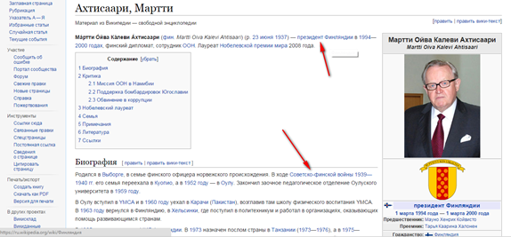
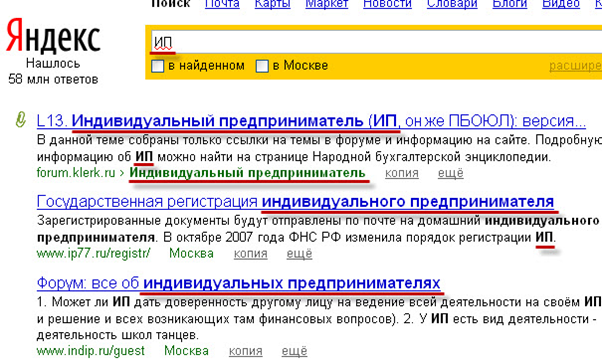

# АНКОР

Анкор, или дословно “якорь, ссылка”, представляет собой текстовое или визуальное содержание, которое помещают между тегами <a> и </a>. Например, <a href="http://www.ratingruneta.ru/seo/">Рейтинг SEO-компаний</a>. В этом случае в качестве анкора выступает заголовок “Рейтинг SEO-компаний”.
Образовавшаяся гиперссылка, или анкор, является элементом навигации. Но она также необходима для оптимизации сайта и интернет-маркетинга.

Для целей продвижения требуется правильно составить анкоры. Основными факторами, влияющими на этот процесс, являются: тематика сайта и популярные запросы в поисковых системах. Исходя из этого, формируется анкор-лист, то есть буквально список анкоров, по которым будет продвигаться сайт.

Профессиональные маркетологи и владельцы сайтов стараются всегда учитывать гипертекстовую разметку и наличие ссылок на другие страницы для развития коммуникации и повышения конверсии. Исследования показывают, что посетители сайта всегда интересуются гиперссылками, ведущими к документам с интересной информацией.

Хотя отношение к Википедии среди пользователей неоднозначное, пример оформления гиперссылок на ресурсе считается одним из лучших.

Однако далеко не каждый анкор может привести посетителя сайта на нужную для его владельца страницу и принести ему определенную пользу. Вот почему необходимо тщательно продумывать содержимое между тегами . Одним из главных требований к анкорам является достоверность, то есть соответствие между названием гиперссылки и содержимым страницы, на которую она приведет.

Анкоры также необходимо составлять таким образом, чтобы посетителю было понятно, куда он попадет, если перейдет по гиперссылке. Некоторые веб-мастера и владельцы сайтов в анкоре ставят слова “здесь” или отдельные термины, которые посетителю сайта ничего не говорят.

Кроме того, такие анкоры абсолютно бесполезны с точки зрения оптимизации и продвижения ресурса. Ведь если в анкоре нет корректной информации о внутренней странице, то поисковая система просто проигнорирует гиперссылку.

Пример того, как Яндекс реагирует на правильно составленный лист анкоров

Таким образом, для того чтобы анкор служил эффективным инструментом навигации и привлечения посетителей на нужные Вам страницы, необходимо:

    - четко выделять гиперссылки на странице среди другого контента,

    - формулировать содержание анкора так, чтобы оно ясно передавало смысл привязанного документа.

Важно также  не переусердствовать с количеством анкоров, иначе посетители сосредоточатся на изучении содержимого гиперссылок, а основной контент окажется бесполезным. Анкоры должны делать сайт удобным и привлекательным для посетителей и потенциальных клиентов и приносить пользу владельцу.