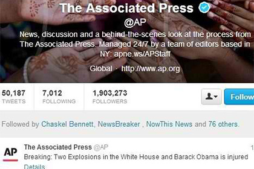
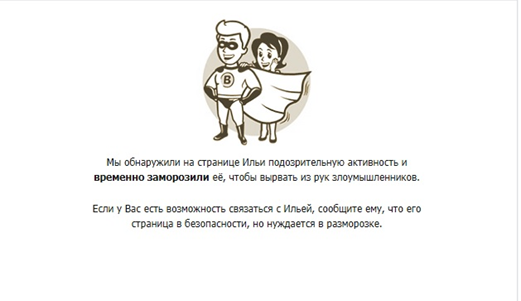

# ВЗЛОМАННЫЙ АККАУНТ

У многих пользователей существует собственный аккаунт, или профиль, в социальных сетях и сервисах. Нередко как физические лица, так и крупные организации сталкиваются со взломом их аккаунтов в Сети. Самым “безобидным” может стать взлом, в результате которого злоумышленники разместят на ресурсе жертвы какую-либо собственную информацию. Гораздо хуже, когда взломанный аккаунт переходит в пользование преступника, планирующего извлечь из этого коммерческую выгоду.

Пример взломанного аккаунта Twitter Агентства AP с сообщением о двух взрывах в Белом доме

Казалось бы, зачем постороннему человеку данные обычного пользователя? В действительности, взлом и возможность распоряжения персональными данными позволяет злоумышленнику использовать профиль жертвы для действий в социальных сетях (писать комментарии, добавлять себя в нужные группы и т.п.). Часто жертва взлома даже не подозревает о том, что ее аккаунтом пользуются мошенники. Подобные инциденты часто происходят в “Одноклассниках”, “ВКонтакте”, Facebook и Twitter.

Взлом аккаунта в сети "ВКонтакте" и его обнаружение администрацией приводит к блокировке страницы пользователя

Как могут использовать взломанный аккаунт в коммерческих целях? Способов достаточно много, и статистика не всегда успевает за криминальными кибер-инноваторами. Однако чаще всего можно встретить такие манипуляции:

    - рекламные сообщения и письма о различных акциях (распродажах и других подобных вещах) на электронную почту, в личные сообщения, на "стену" и другое;
    - попытки привлечь других людей (часто из круга друзей жертвы) к различным коммерческим акциям и сборам денежных средств.

Иногда спамеры используют взломанные аккаунты компаний для их дискредитации, так как почти любого человека раздражает ненужная и навязчивая реклама, даже если она приходит от известного бренда. Часто при сборе средств мошенники указывают маленькую сумму, а в реальности пострадавшие платят больше.

Профессионалы рекомендуют заранее позаботиться о том, чтобы персональный или корпоративный аккаунт не был взломан. Такие меры предосторожности, как регистрация в защищенных почтовых доменах, сложные пароли, специальные антивирусные программы, смогут предотвратить взлом личного профиля и кражу персональных данных.
